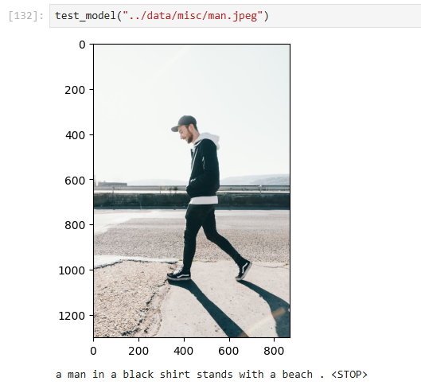
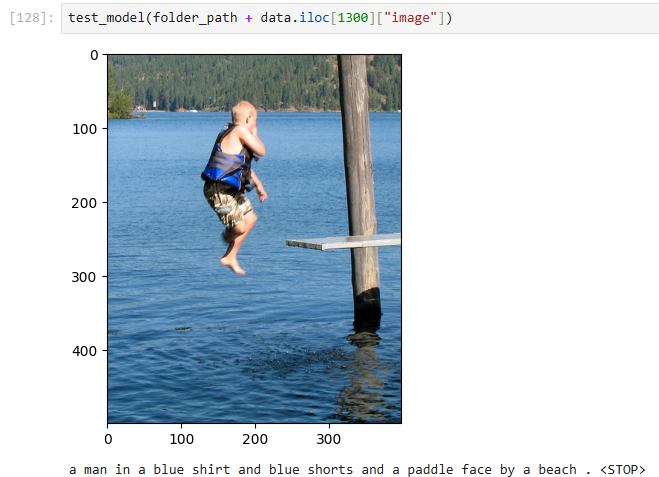
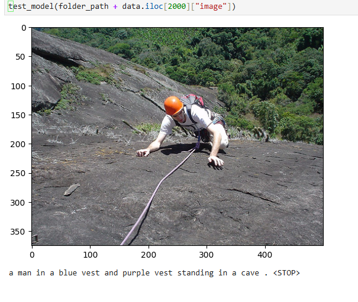
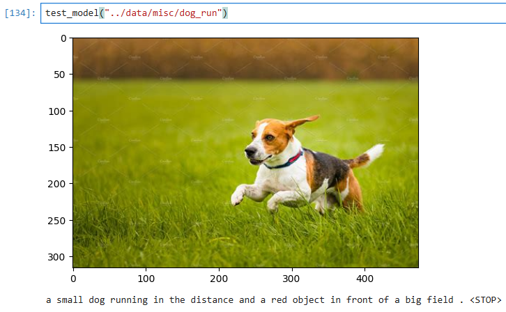

Image Captioning with Flickr8k:
* There are 8k images and each image has 5 different captions = 40k examples.
* Using a Resnet-50 for extracting features and RNN for Generating the captions.
* Embedding Layer is also trainable : Have to change it to pretrained.
* Preprocessing : Need Changes
* Model : Complete
* Training : Going On
* The Model is now able to some what learn the images and captions, after training on `1000` examples:
* Here are some Captions :

